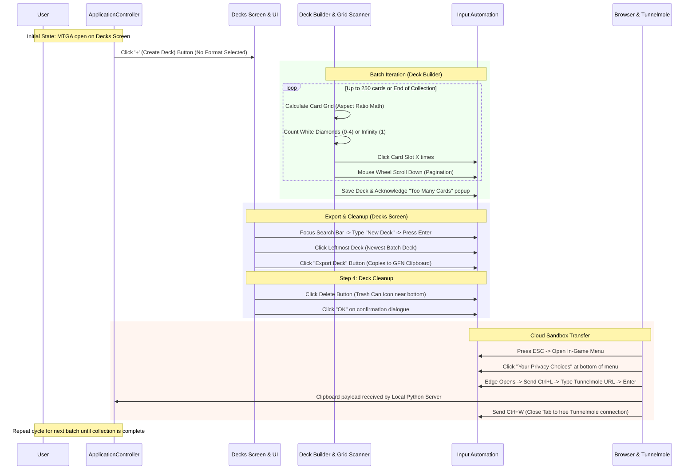

# Architecture Documentation — MTGA Collection Exporter

## Overview

[`MTGA Registrar`](.) — MTGA Collection Exporter — is engineered to extract a user's complete MTGA card collection when playing via **Nvidia GeForce Now**, where direct file system access or memory inspection is unavailable.

## System Design & Modules

The application follows strict object-oriented design principles and is divided into modular components located in [`src/`](src/):

1. **Main Entry Point & Orchestration ([`main.py`](main.py) & [`src/core/app.py`](src/core/app.py))**
   - [`main.py`](main.py): Provides CLI argument parsing, configuration loading, log setup, and execution invocation with support for dry-run mode and transfer provider modes (`clipboard`, `server`, `tunnelmole`).
   - [`src/core/app.py`](src/core/app.py): Implements [`ApplicationController`](src/core/app.py) which ties together vision perception, input automation, collection state tracking, pagination loops, batch chunking, deck cleanup, and export transfer handlers into a cohesive workflow.

2. **Input Automation (`src/automation/`)**
   - Handles mouse and keyboard interaction.
   - Implements human-like movement curves (Bezier curves or variable speed interpolation), randomized click delays, and mouse wheel scrolling to prevent anti-cheat / bot detection.
   - Manages browser navigation for tunneling workflows when interacting with web-based transfer tools.

3. **Image Recognition & UI Perception (`src/vision/`)**
   - Captures screen regions or window handles via [`src/vision/capture.py`](src/vision/capture.py).
   - Detects ownership indicators (evaluating clusters of 4 diamond indicators: white outlined diamonds for owned cards vs. dark grey diamonds for unowned slots, as well as the infinity symbol $\infty$).
   - Calculates dynamic card grid geometry using aspect ratio math (16:9 and 16:10 in List View with 2-row and 3-row zoom levels).
   - Identifies UI navigation elements (Decks screen `+` Create Deck button, search bar, Export button, Delete trash can icon, and confirmation dialogues).

4. **State & Collection Management (`src/core/`)**
   - Manages pagination via mouse wheel scrolling and tracking of processed cards.
   - Batches cards into chunks of up to 250 cards per deck (matching MTGA deck limits).

5. **Export & Transfer Handler (`src/export/`)**
   - Provides a pluggable transfer interface supporting multiple backend implementations.
   - **Local Clipboard Provider:** Interacts directly with the system clipboard when running natively.
   - **Tunnelmole Local Web Server Provider:** Bypasses Nvidia GeForce Now sandboxing restrictions by spinning up a thin local HTTP server, tunneling it securely via Tunnelmole (`tmole`), and directing the GeForce Now Edge browser to paste and transmit exported decklists back to the local Python application.
   - Parses exported decklists into structured Python objects or JSON data via [`src/export/parser.py`](src/export/parser.py).

---

## Detailed Execution Sequence & Flow

---

## Detailed Workflow Steps

### Step 1: Initial State & Deck Creation
1. **Starting Point:** MTGA must be open and positioned on the **Decks Screen** (the "home" screen).
2. **Create Deck:** The program locates and clicks the **`+` (Create Deck)** button.
3. **Format Selection:** Format selection is omitted; choosing no format displays all cards across the collection.

### Step 2: Deck Builder Grid Scanning & Card Addition
1. **View Setting:** Operates in **List View** (assumed or switched).
2. **Aspect Ratio & Card Grid Math:**
   - **16:9 ratio:** 2 rows × 5 columns (standard zoom) or 3 rows × 7 columns (zoomed out).
   - **16:10 ratio:** 2 rows × 4 columns (standard zoom) or 3 rows × 6 columns (zoomed out).
   - Card bounding boxes and centers are calculated via normalized relative coordinates.
3. **Diamond / Infinity Evaluation:**
   - Each card slot header has 4 diamond positions: a bright white diamond indicates ownership of 1 copy, while a dark grey diamond indicates an unowned slot ($X \in [0, 4]$).
   - If an $\infty$ (infinity) symbol is detected (such as for basic lands), exactly 1 copy ($X = 1$) is added to the deck.
   - If $X > 0$, the card is clicked $X$ times with human-like delays.
4. **Pagination:** Advances through the collection using mouse wheel scroll down events (`MouseController.scroll_down`).
5. **Deck Limit (250 Cards):** When 250 cards are added or the end of the collection is reached, the deck is saved and the "Too Many Cards" modal popup is dismissed.

### Step 3: Deck Search, Export & Cleanup
1. **Search & Select:** On the Decks Screen, the program focuses the search bar, types `"New Deck"`, presses `Enter`, and clicks the **leftmost deck** (highest-numbered newest deck due to descending sort order).
2. **Export:** Clicks the **Export Deck** button near the bottom of the screen, placing the decklist on the GFN clipboard.
3. **Deck Deletion & Cleanup:** Immediately clicks the **Delete (trash can icon)** button and clicks **"OK"** on the confirmation dialogue to prevent deck accumulation and naming collisions.

### Step 4: Cloud Sandbox Transfer via Tunnelmole
1. **Open Menu:** Sends the `ESC` key to open the MTGA options menu.
2. **Trigger Browser:** Clicks the **"Your Privacy Choices"** link at the bottom of the menu to launch the Edge browser on the Hasbro privacy page.
3. **Navigate to Tunnel:** Sends `Ctrl + L` to focus the address bar, types the Tunnelmole URL (`https://*.tunnelmole.net`), and presses `Enter`.
4. **Data Transmission:** The browser page transmits the clipboard payload to the local Python HTTP server.
5. **Tab Cleanup:** Sends `Ctrl + W` to close the active tab, preserving the single-connection limit of Tunnelmole for subsequent batches.
